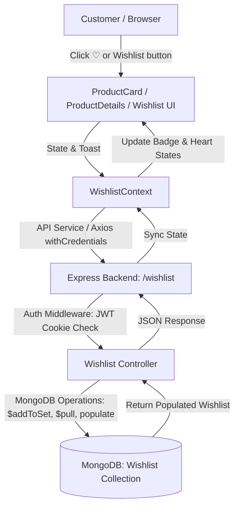
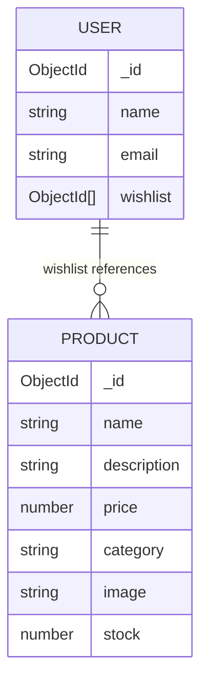
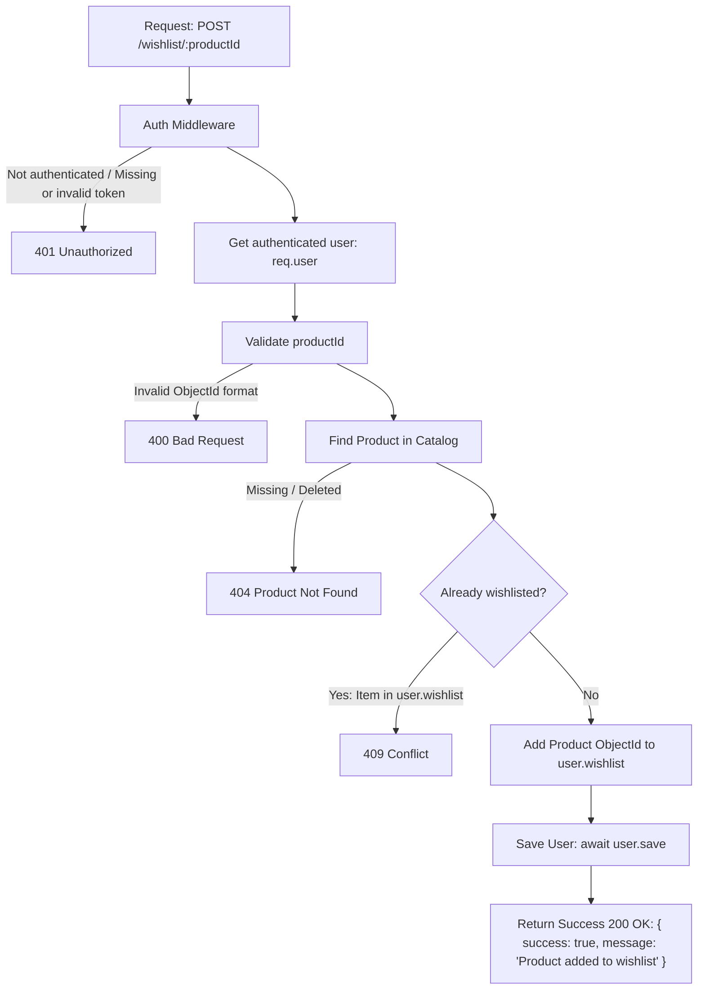
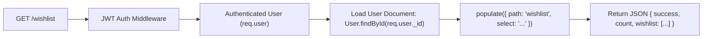

# Wishlist Feature Implementation & Code Explanation (`learn.md`)

This document explains how the **Wishlist Feature** in ShopKart is designed, implemented, and connected across the backend and frontend.

---

## 1. Architecture Overview



---

## 2. Backend Implementation

### A. Data Modeling (`backend/models/wishlist.models.js`)
- **Schema Design**:
  - `user`: References the `User` (`Customer`) model with `unique: true`. Each user has exactly one wishlist document.
  - `products`: An array of `ObjectId` references pointing to the `Product` model.
  - `timestamps: true`: Automatically stores `createdAt` and `updatedAt`.

```javascript
const wishlistSchema = new mongoose.Schema(
  {
    user: {
      type: mongoose.Schema.Types.ObjectId,
      ref: 'User',
      required: true,
      unique: true,
    },
    products: [
      {
        type: mongoose.Schema.Types.ObjectId,
        ref: 'Product',
      },
    ],
  },
  { timestamps: true }
);
```

### B. Business Logic & Controllers (`backend/controllers/wishlist.controller.js`)
1. **Adding a Product (`addToWishlist`)**:
   - Validates that `productId` is a valid MongoDB `ObjectId`.
   - Checks that the product exists in the `Product` collection.
   - Uses `Wishlist.findOneAndUpdate` with MongoDB's `$addToSet` operator.
   - **Preventing Duplicates**: `$addToSet` only inserts an element if it does not already exist in the array, making addition atomic and idempotent.
   - Uses `{ upsert: true, new: true }` so a new wishlist document is automatically created if the user didn't have one yet.
   - Populates `'products'` so the frontend receives full product details immediately.

2. **Fetching Wishlist (`getWishlist`)**:
   - Queries `Wishlist.findOne({ user: req.user._id })`.
   - Chained with `.populate('products')` to hydrate references with actual product name, image, price, stock, category, etc.
   - Returns `{ success: true, count, wishlist }` or an empty list if no wishlist exists yet.

3. **Removing a Product (`removeFromWishlist`)**:
   - Uses MongoDB's `$pull` operator: `{ $pull: { products: productId } }`.
   - Returns the updated populated wishlist.

### C. Route Protection (`backend/routes/wishlist.routes.js`)
- Protects all wishlist endpoints using the `authenticate` middleware (`jwt.verify` on HTTP-only cookie).
- Endpoints:
  - `GET /wishlist` -> Fetch current user's wishlist
  - `POST /wishlist/:productId` -> Add item to wishlist
  - `DELETE /wishlist/:productId` -> Remove item from wishlist

Mounted in `backend/index.js` as `app.use('/wishlist', wishlistRouter);`.

---

## 3. Frontend Implementation

### A. API Layer (`frontend/shopkart/src/services/api.js`)
- Encapsulates Axios requests with `withCredentials: true` (ensuring auth cookies are sent):
  - `getWishlist()`
  - `addToWishlist(productId)`
  - `removeFromWishlist(productId)`

### B. Global State Management (`frontend/shopkart/src/context/WishlistContext.jsx`)
- Provides a centralized `WishlistProvider` accessible by all pages and components.
- State:
  - `wishlist`: Array of populated product objects.
  - `wishlistCount`: Quick access for navbar counter badge.
  - `loadingWishlist`: Boolean loading indicator.
  - `isInWishlist(productId)`: Helper function to determine whether a heart should be rendered active/filled.
  - `addItem(productId, productData)`: Adds product and displays a sleek feedback toast.
  - `removeItem(productId)`: Removes product and provides immediate feedback.
  - `toggleWishlist(productId, productData)`: One-click toggle method for heart buttons.

### C. Components & Pages
1. **Shared Navigation (`frontend/shopkart/src/components/Navbar.jsx`)**:
   - Implements the exact requested navbar menu: **`Home | Products | Wishlist | Logout`**.
   - `Home`: Routes to customer dashboard (`/home`).
   - `Products`: Routes to product catalog (`/products`).
   - `Wishlist`: Displays live counter badge and routes to `/wishlist`.
   - `Logout`: Clears auth cookie via `logoutCustomer()` and redirects to `/login`.

2. **Navigation Flow Architecture**:
   ```mermaid
   graph LR
       Products[/products] -->|Navbar 'Wishlist'| Wishlist[/wishlist]
       Wishlist -->|Click '[ View Details ]'| ProductDetails[/products/:id]
       Wishlist -->|Navbar 'Products' or '[Back to Products]'| Products
       ProductDetails -->|Breadcrumb / Navbar| Products
       Products -->|Navbar 'Home'| Home[/home]
   ```
   - **`Products → Wishlist`**: Users can click the Wishlist link in the Navbar on any product browsing page or navigate after saving a product.
   - **`Wishlist → Product Details`**: Clicking `[ View Details ]` on any `WishlistCard` invokes `navigate('/products/' + id)`.
   - **`Wishlist → Products`**: Handled via the Navbar `Products` link, the header shortcut button `[Back to Products]`, or the empty state's `[Explore Products]` call-to-action.

3. **Product Card (`frontend/shopkart/src/components/ProductCard.jsx`)**:
   - Top-right overlay heart button (`♡` / `♥`) with smooth scale and color transition.
   - Stock information display (e.g. `12 units left` or `Out of stock`).
   - Bottom dual actions: `[ View Details ]` and `[ ♡ Add to Wishlist ]` / `[ ⏳ Saving... ]` / `[ ♥ Added to Wishlist ]`.
   - Calls `POST /wishlist/:productId` on toggle.

4. **Wishlist Card (`frontend/shopkart/src/components/WishlistCard.jsx`)**:
   - Implements the exact 7-field Wishlist Card Specification:
     | Field | Status | Presentation |
     |---|---|---|
     | **Product image** | ✅ Required | Full card-width preview with smooth hover scale and fallback |
     | **Product name** | ✅ Required | Bold, truncated title with hover accent |
     | **Price** | ✅ Required | Highlighted currency format: `₹X,XXX` |
     | **Category** | ✅ Required | Category description under product title |
     | **Stock status** | ✅ Required | Dynamic stock text: `{stock} units left` or `Out of stock` |
     | **View Details** | ✅ Required | `[ View Details ]` button routing to `/products/:id` |
     | **Remove from Wishlist** | ✅ Required | `[ Remove ♥ ]` button with per-item `Removing...` spinner |

5. **Wishlist Page (`frontend/shopkart/src/pages/Wishlist.jsx`)**:
   - **Route**: Dedicated route at `/wishlist`.
   - **Navigation Header**: Adheres to `ShopKart` (logo) with `Home | Products | Wishlist | Logout`.
   - **Header Section**: Clean title `My Wishlist` with item counter subtitle `{count} products saved` and `[Back to Products]` link.
   - **Loading State (`10. ⏳ Loading State`)**:
     - Never renders a blank screen while the wishlist API is running.
     - Displays intentional feedback elements:
       - **Text**: Explicitly indicates `Loading your wishlist...` both in the header counter and in the central status indicator.
       - **Spinner**: Smooth CSS-animated circular spinner with pink accent.
       - **Skeleton Cards**: Animated pulse cards matching the exact 7-field structure of `WishlistCard` (image, title, category, price, stock, view button, remove button) to prevent layout shifts.
       - **Zero-Flash Initialization**: `loadingWishlist` is initialized to `true` in `WishlistContext.jsx` to prevent any flash of the empty state before the initial fetch resolves.
   - **Error State (`11. ❌ Error State`)**:
     - Renders if loading the wishlist API fails (due to network disruption, server downtime, etc.).
     - Prevents silent failures or blank views.
     - **Visual Anatomy**:
       - **Icon**: Distinct alert/warning indicator.
       - **Title**: `Something went wrong.`.
       - **Subtitle**: `We couldn't load your wishlist.`.
       - **Action**: `[ Try Again ]` button that re-triggers `refreshWishlist()`, immediately initiating a fresh API request without requiring a full page refresh.
   - **Empty State (`9. 💤 Empty Wishlist State`)**:
     - Never renders a blank page when `count === 0` and there are no errors.
     - Features centered visual anatomy:
       - **Visual**: Red Heart icon (`❤️`) with subtle bounce animation.
       - **Title**: `Your wishlist is empty`.
       - **Copy**: `Save products you love and find them here later.`.
       - **Call-to-Action**: `[ Browse Products ]` button linking to `/products`.
   - **Populated View**: Responsive grid rendering `WishlistCard` components.

6. **Product Details Page (`frontend/shopkart/src/pages/ProductDetails.jsx`)**:
   - Features a Wishlist toggle button alongside the "Add to Cart" action with synchronized state.

---

## 4. React & Router Hooks Breakdown (Why & How They Are Used)

Here is an in-depth breakdown of every hook utilized in the frontend architecture and the reasoning behind each choice:

### 1. `useContext` & Custom `useWishlist` Hook
- **Files**: `frontend/shopkart/src/context/WishlistContext.jsx`, `Navbar.jsx`, `ProductCard.jsx`, `ProductDetails.jsx`, `Wishlist.jsx`
- **Why**:
  - **Eliminates Prop Drilling**: Without Context, we would need to pass wishlist data and handlers through multiple intermediate components (`App` ➔ `Products` ➔ `ProductCard` and `App` ➔ `Navbar`).
  - **Single Source of Truth**: When a user clicks the heart icon on any `ProductCard` or on `ProductDetails`, the global state updates immediately. Both the `Navbar` badge count and all corresponding heart states reflect this change in sync.

### 2. `useState`
- **Files**: `WishlistContext.jsx`, `ProductCard.jsx`, `ProductDetails.jsx`, `Wishlist.jsx`, `Products.jsx`
- **Why**:
  - **`wishlist` & `loadingWishlist`**: Tracks the array of wishlisted products and loading spinner states in Context.
  - **`toast`**: Manages temporary feedback alerts (`{ message, type }`) whenever an item is added or removed.
  - **`isUpdatingWishlist`**: Manages local button loading states in `ProductCard` and `ProductDetails` to show spinners and prevent duplicate spam clicks during inflight HTTP requests.
  - **`removingId`**: In `Wishlist.jsx`, tracks which specific product is currently being deleted so only that card's button shows a loading spinner rather than blocking the entire grid.
  - **`imgSrc`**: Handles dynamic image fallbacks when an image URL fails to load.

### 3. `useEffect`
- **Files**: `WishlistContext.jsx`, `Wishlist.jsx`, `Products.jsx`, `ProductDetails.jsx`
- **Why**:
  - **Initial State Synchronization**: In `WishlistContext`, an initial `useEffect` runs once on application mount to fetch the authenticated user's saved wishlist.
  - **Route & Mount Re-fetching**: In `Wishlist.jsx`, triggers `refreshWishlist()` whenever the user navigates directly to `/wishlist`.
  - **Debounced Search/Filter**: In `Products.jsx`, listens to `[search, category]` changes and sets a 500ms timer before querying backend API, preventing excessive database queries on every keystroke.
  - **Parameter-driven Fetching**: In `ProductDetails.jsx`, triggers product data retrieval whenever the route parameter `id` changes.

### 4. `useCallback`
- **Files**: `WishlistContext.jsx`, `Products.jsx`
- **Why**:
  - **Preventing Unnecessary Re-renders**: Functions like `fetchWishlist`, `showToast`, and `isInWishlist` are passed as values in `WishlistContext.Provider`.
  - Wrapping them in `useCallback` ensures their function references remain stable across component renders unless their internal dependencies change.
  - This prevents consumer components (like `Navbar` and `ProductCard`) from re-rendering unnecessarily and satisfies `useEffect` dependency array rules without causing infinite loops.

### 5. `useRef`
- **Files**: `Products.jsx`
- **Why**:
  - `hasLoadedOnce`: Stores a mutable boolean flag (`hasLoadedOnce.current = true`) that persists across component re-renders without triggering additional render cycles itself.
  - This allows the UI to display a full skeleton loader on first visit, but maintain smooth in-place filtering on subsequent searches.

### 6. `useNavigate` (React Router)
- **Files**: `Navbar.jsx`, `ProductCard.jsx`, `ProductDetails.jsx`, `Wishlist.jsx`
- **Why**:
  - Provides programmatic navigation:
    - Automatically redirects an unauthenticated user to `/login` if a wishlist API request returns a `401 Unauthorized` status.
    - Routes users to product detail views (`/products/${productId}`) upon clicking "View Details".

### 7. `useParams` (React Router)
- **Files**: `ProductDetails.jsx`
- **Why**:
  - Extracts the dynamic URL segment `:id` (e.g. `/products/65fa...`) to fetch and render the specific product details from the backend.

### 8. `useLocation` (React Router)
- **Files**: `Navbar.jsx`
- **Why**:
  - Inspects `location.pathname` to conditionally apply active tab highlights and styles to navigation items (e.g. highlighting the Wishlist or Explore buttons when active).

---

## 5. Wishlist Interaction States & Failure Handling

A reliable e-commerce experience requires explicit, non-silent communication at each stage of a user action. The wishlist implementation uses a state-machine pattern across `ProductCard.jsx`, `ProductDetails.jsx`, and `WishlistContext.jsx`:

```mermaid
stateDiagram-v2
    [*] --> Default: Initial Render
    Default --> RequestInProgress: User clicks "Add to Wishlist"
    RequestInProgress --> RequestInProgress: Extra clicks blocked (inFlightRef guard)
    RequestInProgress --> Success: 200 OK from POST /wishlist/:id
    RequestInProgress --> Failure: Network failure or 4xx/5xx error
    Success --> Default: User toggles off / removes
    Failure --> RequestInProgress: User clicks "Retry"
```

### State Breakdown

| State | Visual Representation | Technical Mechanism & Behavior |
|---|---|---|
| **Default** | `♡ Add to Wishlist` | Standard interactive button (indigo accent) with an outlined heart icon. Indicates item is not currently in the user's wishlist. |
| **Request in progress** | `⏳ Saving...` | <ul><li>Button is disabled (`disabled={isSaving}`)</li><li>`inFlightRef.current` provides a synchronous re-entrancy lock preventing duplicate requests from fast double-clicks</li><li>`WishlistContext.pendingRequests` (Set of product IDs) provides context-wide duplicate request prevention</li><li>Animated hourglass/spinner with amber styling communicates work in progress</li></ul> |
| **Success** | `♥ Added to Wishlist` | Active state featuring a filled pink heart icon (`♥`) and clear confirmation label. Synchronized across `Navbar` badge, catalog cards, and details pages. |
| **Failure** | `"Unable to save product. Please try again."` | <ul><li>**Do Not Silently Fail**: If the API call fails or encounters network drops, an error banner is rendered directly on the product card/view.</li><li>**Actionable Recovery**: Includes an inline `"Retry"` button allowing the user to seamlessly attempt the request again.</li><li>**Toast Alert**: Accompanied by a floating toast notification informing the user.</li></ul> |

---

## 6. Key Verification Checklist

| Requirement | Implementation Status | How it was achieved |
|---|---|---|
| **Add to Wishlist** | ✅ Complete | `POST /wishlist/:productId` with `$addToSet` |
| **Prevent Duplicates** | ✅ Complete | MongoDB `$addToSet` + synchronous `inFlightRef` + Context `pendingRequests` guard |
| **View Wishlist** | ✅ Complete | `GET /wishlist` with `.populate('products')` |
| **Remove Product** | ✅ Complete | `DELETE /wishlist/:productId` with `$pull` |
| **MongoDB Persistence** | ✅ Complete | `Wishlist` collection with user foreign key and product refs |
| **API Protection** | ✅ Complete | `authenticate` JWT cookie middleware applied on `/wishlist` |
| **Interaction States** | ✅ Complete | Default (`♡ Add to Wishlist`), Saving (`⏳ Saving...`), Success (`♥ Added to Wishlist`), and Failure (`Unable to save product. Please try again.`) |
| **Non-Silent Errors** | ✅ Complete | Inline error banner with `Retry` action + toast alerts |
| **Wishlist Card Spec** | ✅ Complete | Product image, name, category, price (₹), stock status, `[ View Details ]`, and `[ Remove ♥ ]` |
| **Empty State Spec** | ✅ Complete | Red Heart (`❤️`), `Your wishlist is empty`, subtitle copy, and `[ Browse Products ]` redirect |
| **Loading State Spec** | ✅ Complete | Intentional state: `Loading your wishlist...` text + spinner + zero-flash skeleton cards |
| **Error State Spec** | ✅ Complete | Explicit state: `Something went wrong.` + `We couldn't load your wishlist.` + `[ Try Again ]` retry action |
| **Wishlist Navigation** | ✅ Complete | Navbar icon + badge counter + My Profile shortcuts |
| **Hooks Optimization** | ✅ Complete | `useContext`, `useCallback`, `useState`, `useEffect`, `useRef`, and React Router hooks |
| **Data Model References** | ✅ Complete | Stores `ObjectId` references to `Product` (no duplicated product objects), populated dynamically |
| **Task 1: Extend User Schema** | ✅ Complete | Added `wishlist: [{ type: Schema.Types.ObjectId, ref: 'Product' }]` with `default: []` |
| **Task 2: Add Product to Wishlist API** | ✅ Complete | `POST /wishlist/:productId` with auth identification, 400/404/409 error handling & success response |
| **Task 3: Get Wishlist API** | ✅ Complete | `GET /wishlist` populates references, returns `{ success: true, count, wishlist: [...] }`, strictly NO `GET /wishlist/:userId` |
| **Task 4: Remove Product API** | ✅ Complete | `DELETE /wishlist/:productId` with auth identification, 400, 404 (not in wishlist), and success response |
| **Task 5: API Contract** | ✅ Complete | Complete REST contract for `POST`, `GET`, `DELETE` on `/wishlist` with mandatory auth |
| **Task 5 (FE): Product Card Integration** | ✅ Complete | Updated ProductCard with `♡ Add to Wishlist`, `⏳ Saving...`, `♥ Added to Wishlist`, duplicate guards & non-silent errors |
| **Task 6 (FE): Wishlist Page** | ✅ Complete | `/wishlist` fetching `GET /wishlist`, dynamic rendering, `[ View Details ]` & `[ Remove from Wishlist ]` |
| **Task 7 (FE): Loading, Empty & Error States** | ✅ Complete | Loading (`Loading your wishlist...`), Empty (`Your wishlist is empty ❤️`), Error (`Unable to load wishlist.` + `[ Try Again ]`) |
| **Task 8 (FE): Navbar + Routing** | ✅ Complete | Added `Wishlist` with badge counter to Navbar, registered `/wishlist` route in React Router |

---

## 7. Data Model: Relational Design, ER Diagram & Reference Architecture

### A. The Core Engineering Problem

In an e-commerce application, the relationship between customers, their saved items, and the catalog is fundamentally relational:

```
User
  │
  │ owns
  ▼
Wishlist
  │
  │ references
  ▼
Products
```

- A **User** owns a single **Wishlist** (1-to-1 relationship).
- A **Wishlist** contains references to multiple **Products** (1-to-many relationship).
- A **Product** can be referenced by many users' wishlists (many-to-many relationship between Users and Products).

### B. Entity Relationship (ER) Diagram



### C. Schema Definitions

#### 1. User Entity (`backend/models/customer.models.js`)
```javascript
const userSchema = new mongoose.Schema(
  {
    name: { type: String },
    fullname: { type: String, required: true },
    email: { type: String, required: true, unique: true },
    password: { type: String, required: true },
    phone: { type: String, required: true },
    wishlist: [
      {
        type: mongoose.Schema.Types.ObjectId,
        ref: "Product",
      },
    ],
    createdAt: { type: Date, default: Date.now },
  },
  {
    toJSON: { virtuals: true },
    toObject: { virtuals: true },
  }
);
```

#### 2. Product Entity (`backend/models/product.models.js`)
```javascript
const productSchema = new mongoose.Schema({
  name: { type: String, required: true, trim: true },
  description: { type: String, required: true },
  price: { type: Number, required: true, min: [0.01, "Price must be greater than 0"] },
  category: { type: String, required: true, trim: true },
  image: { type: String, required: true },
  stock: { type: Number, required: true, min: 0, default: 0 },
  createdAt: { type: Date, default: Date.now },
});
```

#### 3. Wishlist Entity (`backend/models/wishlist.models.js`)
```javascript
const wishlistSchema = new mongoose.Schema(
  {
    user: {
      type: mongoose.Schema.Types.ObjectId,
      ref: 'User',
      required: true,
      unique: true,
    },
    products: [
      {
        type: mongoose.Schema.Types.ObjectId,
        ref: 'Product',
      },
    ],
  },
  { timestamps: true }
);
```

---

### D. Critical Design Rule: References vs. Duplicated Product Objects

> [!IMPORTANT]
> **Design Rule**: The wishlist **MUST** contain Product references (`ObjectId[]`), **NOT** duplicated Product objects.

Why is duplicating product documents in a wishlist considered an anti-pattern?

1. **Price & Stock Drift (Stale Data)**:
   - In e-commerce, product prices, discounts, and inventory change constantly.
   - If an entire product object (`{ name, price: 2999, stock: 10, ... }`) were cloned into the user's wishlist document at the moment they clicked `♡`, any subsequent price drop, discount event, or inventory depletion would never be reflected in their wishlist.
   - The user would see outdated information (e.g. seeing "10 units left" when the item is actually sold out), leading to cart checkout errors and poor customer trust.

2. **Storage Bloat (Data Redundancy)**:
   - Product objects contain lengthy descriptions, high-resolution image URLs, specifications, and metadata.
   - Storing a 2KB product object in 10,000 user wishlists consumes 20MB of redundant data in the database for a single product.
   - In contrast, a MongoDB `ObjectId` is a compact **12-byte BSON value**. Storing only references reduces database footprint by more than 99%.

3. **Populate on Demand (Dynamic Hydration)**:
   - When the user visits `/wishlist`, Mongoose resolves the references in a single query via `.populate('products')` (or `.populate('wishlist')`).
   - The API delivers live, up-to-the-minute product information (real-time price, current stock level, updated image) straight from the primary `Product` collection.

4. **Catalog Integrity & Orphan Management**:
   - If a product is updated by an admin, the change immediately appears in all users' wishlists without needing batch update jobs across the database.
   - If a product is permanently removed from the catalog, unresolvable references can be safely filtered out (`wishlist.products.filter(Boolean)`), ensuring clean data handling.

---

## 8. ❌ What NOT To Store vs. ✅ What TO Store (The Source of Truth Principle)

A common pitfall in NoSQL / MongoDB document database design is over-embedding data. Storing full product snapshots inside a wishlist is an anti-pattern.

### The Contrast

#### ❌ Anti-Pattern: Embedding Full Product Objects
```javascript
// DO NOT STORE THIS IN THE DATABASE
{
  "_id": ObjectId("65fa00000000000000000001"),
  "name": "Jane Doe",
  "email": "jane@example.com",
  "wishlist": [
    {
      "name": "Mechanical Keyboard",
      "price": 2999,
      "image": "https://images.unsplash.com/photo-1587829741301-dc798b83add3",
      "category": "Electronics",
      "stock": 10
    }
  ]
}
```

#### ✅ Correct Architecture: Storing `ObjectId` References
```javascript
// STORE ONLY REFERENCES IN THE DATABASE
{
  "_id": ObjectId("65fa00000000000000000001"),
  "name": "Jane Doe",
  "email": "jane@example.com",
  "wishlist": [
    ObjectId("65fa11111111111111111111")
  ]
}
```

---

### Why? The Product Collection Remains the Source of Truth

| Concern | ❌ Duplicated Product Objects | ✅ `ObjectId` References + `.populate()` |
|---|---|---|
| **Price Changes** | **Stale**: If a merchant discounts the keyboard to ₹2,499, the user's wishlist still says ₹2,999. | **Real-Time**: When the user opens `/wishlist`, `.populate('products')` fetches the live ₹2,499 price. |
| **Stock Depletion** | **Ghost Stock**: Wishlist says "10 units left", but the item is sold out. User faces checkout errors. | **Instant Visibility**: Fetches live stock (`0 units left` / `Out of stock`). |
| **Image & Description Updates** | **Outdated**: Changed imagery or title fixes don't propagate to saved wishlists. | **Always Fresh**: Immediate display of current media and descriptions. |
| **Database Storage** | **Bloated**: 2KB per product duplicated across 50,000 wishlists = 100MB of wasted storage. | **Efficient**: Exactly 12 bytes per reference (BSON ObjectId), saving >99% storage. |
| **Write Amplification** | **High Overhead**: Updating a product requires a database-wide scan to update thousands of user wishlists. | **Single Point Update**: Modify 1 document in the `Product` collection; all wishlists reflect it instantly. |

### How It Works in Our Implementation

1. **Saving to Wishlist** ([`wishlist.controller.js`](file:///home/adit-t-krishnadas/Desktop/ShopKart/backend/controllers/wishlist.controller.js)):
   ```javascript
   // Only the 12-byte productId is added via $addToSet
   await User.findByIdAndUpdate(
     req.user._id,
     { $addToSet: { wishlist: productId } },
     { new: true }
   );
   ```

2. **Fetching Wishlist with Dynamic Hydration**:
   ```javascript
   // Populates references in-memory for the response without duplicating data on disk
   const wishlist = await Wishlist.findOne({ user: req.user._id }).populate('products');
   ```

---

## 9. 🧩 Task Breakdown: Task 1 — Extend User Schema (15 Marks)

In [`backend/models/customer.models.js`](file:///home/adit-t-krishnadas/Desktop/ShopKart/backend/models/customer.models.js), the `User` schema has been extended to include a `wishlist` field adhering to all 4 required constraints:

### A. Required Shape Implementation

```javascript
import mongoose, { Schema } from "mongoose";

const userSchema = new mongoose.Schema(
  {
    name: { type: String },
    fullname: { type: String, required: true },
    email: { type: String, required: true, unique: true },
    password: { type: String, required: true },
    phone: { type: String, required: true },
    wishlist: [
      {
        type: Schema.Types.ObjectId,
        ref: "Product",
      },
    ],
    createdAt: { type: Date, default: Date.now },
  },
  {
    toJSON: { virtuals: true },
    toObject: { virtuals: true },
  }
);

// Ensure default to empty array [] so existing users without wishlist field work seamlessly
userSchema.path("wishlist").default([]);
```

### B. Requirements & Verification

| Requirement | Implementation Detail | Status |
|---|---|---|
| **Use `Schema.Types.ObjectId`** | Imported `Schema` from `mongoose` and used `type: Schema.Types.ObjectId` (or `mongoose.Schema.Types.ObjectId`) for each element. | ✅ Verified |
| **Reference `Product`** | Configured `ref: "Product"` on the embedded schema type, enabling Mongoose `.populate("wishlist")`. | ✅ Verified |
| **Default to `[]`** | Array schema default combined with explicit `userSchema.path("wishlist").default([])` ensures any newly created document initializes with `wishlist: []`. | ✅ Verified |
| **Existing Users Continue to Work** | When documents created prior to this field are loaded via `User.find()` or `User.hydrate()`, Mongoose applies schema defaults, ensuring `user.wishlist` evaluates to an empty array `[]` rather than throwing errors. | ✅ Verified |

### C. Test Verification Output
```bash
instance: Array
embedded instance: ObjectId
ref: Product
defaultValue: []
New user default wishlist: []
Existing user wishlist: []
```

---

## 10. 🧩 Task Breakdown: Task 2 — Add Product to Wishlist API (15 Marks)

### A. Endpoint & Authentication
- **Endpoint**: `POST /wishlist/:productId`
- **Authentication**: Uses [`authenticate`](file:///home/adit-t-krishnadas/Desktop/ShopKart/backend/middlewares/auth.middleware.js) middleware.
- **Identity Resolution**: Identifies the user strictly via authenticated request (`req.user` verified from JWT token via HTTP-only cookie or `Authorization: Bearer <token>`).
- **Security Rule**: Does **NOT** accept `userId` from the request body.

### B. Backend Flow Architecture



### C. Request & Response Specification

#### Request Format
```http
POST /wishlist/66d123abc456...
Authorization: Bearer <token>
```

#### Success Response (Status 200)
```json
{
  "success": true,
  "message": "Product added to wishlist"
}
```

#### Failure Status Scenarios
| Scenario | HTTP Status | Response Example |
|---|---|---|
| **Not authenticated** | `401 Unauthorized` | `{ "success": false, "message": "Unauthorized, token not provided." }` |
| **Invalid product ID** | `400 Bad Request` | `{ "success": false, "message": "Invalid product ID" }` |
| **Product not found** | `404 Not Found` | `{ "success": false, "message": "Product not found" }` |
| **Already in wishlist** | `409 Conflict` | `{ "success": false, "message": "Already in wishlist" }` |

### D. Controller Code Implementation ([`wishlist.controller.js`](file:///home/adit-t-krishnadas/Desktop/ShopKart/backend/controllers/wishlist.controller.js))

```javascript
export const addToWishlist = async (req, res) => {
  try {
    if (!req.user || !req.user._id) {
      return res.status(401).json({ success: false, message: 'Unauthorized' });
    }

    const { productId } = req.params;

    if (!mongoose.Types.ObjectId.isValid(productId)) {
      return res.status(400).json({ success: false, message: 'Invalid product ID' });
    }

    const product = await Product.findById(productId);
    if (!product) {
      return res.status(404).json({ success: false, message: 'Product not found' });
    }

    const user = await User.findById(req.user._id);
    if (!user) {
      return res.status(401).json({ success: false, message: 'User not found' });
    }

    const isAlreadyWishlisted =
      user.wishlist &&
      user.wishlist.some((id) => id.toString() === productId.toString());

    if (isAlreadyWishlisted) {
      return res.status(409).json({ success: false, message: 'Already in wishlist' });
    }

    user.wishlist.push(productId);
    await user.save();

    await Wishlist.findOneAndUpdate(
      { user: req.user._id },
      { $addToSet: { products: productId } },
      { new: true, upsert: true }
    );

    return res.status(200).json({
      success: true,
      message: 'Product added to wishlist',
    });
  } catch (error) {
    return res.status(500).json({
      success: false,
      message: error.message || 'Failed to add product to wishlist',
    });
  }
};
```

---

## 11. 🧩 Task Breakdown: Task 3 — Get Current User's Wishlist (20 Marks)

### A. Endpoint & Security Architecture
- **Endpoint**: `GET /wishlist`
- **Authentication**: Secured via `authenticate` JWT middleware.
- **Identity Isolation**: The server strictly identifies the current user from the authenticated token payload (`req.user._id`).
- > [!CAUTION]
  > **Important Security Rule**: Do **NOT** create `GET /wishlist/:userId`. The client must never be allowed to supply or choose which user's wishlist it can access. All access is strictly bound to the authenticated JWT session.

### B. Flowchart



### C. Example Response Structure
```json
{
  "success": true,
  "count": 2,
  "wishlist": [
    {
      "_id": "66d123",
      "name": "Mechanical Keyboard",
      "price": 2999,
      "category": "Electronics",
      "image": "https://example.com/keyboard.jpg",
      "stock": 10
    },
    {
      "_id": "66d456",
      "name": "Wireless Headphones",
      "price": 4999,
      "category": "Electronics",
      "image": "https://example.com/headphones.jpg",
      "stock": 5
    }
  ]
}
```

### D. Implementation Details ([`wishlist.controller.js`](file:///home/adit-t-krishnadas/Desktop/ShopKart/backend/controllers/wishlist.controller.js))

```javascript
export const getWishlist = async (req, res) => {
  try {
    if (!req.user || !req.user._id) {
      return res.status(401).json({
        success: false,
        message: 'Unauthorized',
      });
    }

    // Load User and dynamically populate product references
    let user = await User.findById(req.user._id).populate({
      path: 'wishlist',
      select: 'name price category image stock description',
    });

    if (!user) {
      return res.status(404).json({
        success: false,
        message: 'User not found',
      });
    }

    // Filter any dangling references if a product was deleted from the catalog
    const products = (user.wishlist || []).filter(Boolean);

    return res.status(200).json({
      success: true,
      count: products.length,
      wishlist: products,
      products: products, // included for client compatibility
    });
  } catch (error) {
    return res.status(500).json({
      success: false,
      message: error.message || 'Failed to fetch wishlist',
    });
  }
};
```

---

## 12. 🧩 Task Breakdown: Task 4 — Remove Product from Wishlist (10 Marks)

### A. Endpoint Specification
- **Endpoint**: `DELETE /wishlist/:productId`
- **Authentication**: Uses [`authenticate`](file:///home/adit-t-krishnadas/Desktop/ShopKart/backend/middlewares/auth.middleware.js) JWT middleware. Identifies user from `req.user._id`.

### B. Backend Flow Architecture

```
Request: DELETE /wishlist/:productId
   ↓
Authenticate (validate JWT -> 401 if missing/invalid)
   ↓
Find Current User (load user document)
   ↓
Check Wishlist (is productId in user.wishlist? -> 404 if not found)
   ↓
Remove Product Reference (filter out productId from array)
   ↓
Save User (await user.save())
   ↓
Return Success (200 OK: { success: true, message: "Product removed from wishlist" })
```

### C. Failure Scenarios & Status Codes

| Scenario | HTTP Status | Response Example |
|---|---|---|
| **Not authenticated** | `401 Unauthorized` | `{ "success": false, "message": "Unauthorized, token not provided." }` |
| **Invalid product ID** | `400 Bad Request` | `{ "success": false, "message": "Invalid product ID" }` |
| **Product not in wishlist** | `404 Not Found` | `{ "success": false, "message": "Product not in wishlist" }` |
| **Success** | `200 OK` | `{ "success": true, "message": "Product removed from wishlist" }` |

### D. Implementation Details ([`wishlist.controller.js`](file:///home/adit-t-krishnadas/Desktop/ShopKart/backend/controllers/wishlist.controller.js))

```javascript
export const removeFromWishlist = async (req, res) => {
  try {
    // 1. Authenticate
    if (!req.user || !req.user._id) {
      return res.status(401).json({ success: false, message: 'Unauthorized' });
    }

    const { productId } = req.params;

    // 2. Validate productId format
    if (!mongoose.Types.ObjectId.isValid(productId)) {
      return res.status(400).json({ success: false, message: 'Invalid product ID' });
    }

    // 3. Find Current User
    const user = await User.findById(req.user._id);
    if (!user) {
      return res.status(401).json({ success: false, message: 'User not found' });
    }

    // 4. Check Wishlist: Does the product exist in the user's wishlist?
    const isProductInWishlist =
      user.wishlist &&
      user.wishlist.some((id) => id.toString() === productId.toString());

    if (!isProductInWishlist) {
      return res.status(404).json({ success: false, message: 'Product not in wishlist' });
    }

    // 5. Remove Product Reference
    user.wishlist = user.wishlist.filter(
      (id) => id.toString() !== productId.toString()
    );

    // 6. Save User
    await user.save();

    // Synchronize Wishlist collection
    await Wishlist.findOneAndUpdate(
      { user: req.user._id },
      { $pull: { products: productId } },
      { new: true }
    );

    // 7. Return Success Response
    return res.status(200).json({
      success: true,
      message: 'Product removed from wishlist',
    });
  } catch (error) {
    return res.status(500).json({
      success: false,
      message: error.message || 'Failed to remove product from wishlist',
    });
  }
};
```

---

## 13. 🔌 Wishlist API Contract & Route Specification

The ShopKart Wishlist API implements a clean, RESTful interface where all endpoints require authentication and identify the caller strictly via the authenticated session.

### A. The Core API Contract

| Method | Endpoint | Auth | Purpose | Request Parameters | Success Status | Success Body |
|---|---|:---:|---|---|:---:|---|
| **`POST`** | `/wishlist/:productId` | ✅ | Add product to current user's wishlist | URL Param: `productId` (ObjectId) | `200 OK` | `{"success": true, "message": "Product added to wishlist"}` |
| **`GET`** | `/wishlist` | ✅ | Get current user's wishlist with populated products | *None* (derived from JWT) | `200 OK` | `{"success": true, "count": N, "wishlist": [...]}` |
| **`DELETE`** | `/wishlist/:productId` | ✅ | Remove product from current user's wishlist | URL Param: `productId` (ObjectId) | `200 OK` | `{"success": true, "message": "Product removed from wishlist"}` |

---

### B. Route Implementation ([`backend/routes/wishlist.routes.js`](file:///home/adit-t-krishnadas/Desktop/ShopKart/backend/routes/wishlist.routes.js))

All operations are grouped under the `/wishlist` mount path in [`backend/index.js`](file:///home/adit-t-krishnadas/Desktop/ShopKart/backend/index.js) and protected with the JWT `authenticate` middleware:

```javascript
import express from 'express';
import {
  addToWishlist,
  getWishlist,
  removeFromWishlist,
} from '../controllers/wishlist.controller.js';
import authenticate from '../middlewares/auth.middleware.js';

const router = express.Router();

// All wishlist operations require authenticated user (JWT in Cookie or Bearer header)
router.use(authenticate);

router.post('/:productId', addToWishlist);
router.get('/', getWishlist);
router.delete('/:productId', removeFromWishlist);

export default router;
```

---

### C. Security Principles & Contract Rules

1. **Authentication Required (`Auth: ✅`)**:
   - Every request must provide a valid JWT token either via HTTP-only cookie (`token=<jwt>`) or the Authorization header (`Authorization: Bearer <jwt>`).
   - Requests without a valid token receive `401 Unauthorized`.

2. **Session-Bound Identity (No `:userId` in URLs)**:
   - There is deliberately **no** endpoint like `GET /wishlist/:userId` or `POST /wishlist/:userId/:productId`.
   - The user's identity is always extracted from the cryptographically verified JWT payload (`req.user._id`).
   - Clients cannot spoof or access other users' saved wishlists.

3. **Input Validation**:
   - `productId` URL parameters are strictly validated using `mongoose.Types.ObjectId.isValid(productId)`.
   - Invalid IDs immediately fail with `400 Bad Request`.

4. **Failure State Matrix**:
   | Status Code | Description | Trigger |
   |---|---|---|
   | **`400 Bad Request`** | Invalid product ID format | Malformed `productId` param |
   | **`401 Unauthorized`** | Missing or invalid auth token | Missing cookie/header or expired JWT |
   | **`404 Not Found`** | Product not found / not in wishlist | Product missing in catalog on add, or not present on remove |
   | **`409 Conflict`** | Already in wishlist | Attempting to re-add a product already in user's wishlist |

---

## 14. 🖥️ Frontend Requirements: Task 5 — Product Card Integration (10 Marks)

The `ProductCard` component in [`frontend/shopkart/src/components/ProductCard.jsx`](file:///home/adit-t-krishnadas/Desktop/ShopKart/frontend/shopkart/src/components/ProductCard.jsx) has been enhanced to implement the 4 interactive wishlist states and meet all frontend requirements.

### A. The 4 Interaction States

| State | Visual Treatment | Technical Mechanism |
|---|---|---|
| **Default** | `♡ Add to Wishlist` | Active interactive button with hollow heart symbol (`♡`). Displayed when the product is not in the user's wishlist. |
| **While request is running** | `⏳ Saving...` | Button is disabled (`disabled={isSaving}`). Displays animated hourglass icon (`⏳`) and `Saving...` text. Duplicates are blocked. |
| **After success** | `♥ Added to Wishlist` | Active confirmation styling with filled pink heart (`♥`) and `Added to Wishlist` label. Synchronized across global `WishlistContext`. |
| **On failure** | Useful error banner | Exposes an inline error banner (`Unable to save product. Please try again.`) with an immediate `[ Retry ]` button and toast feedback. |

### B. Requirements & Engineering Solutions

1. **No Page Refresh**:
   - `handleWishlistClick` calls `e.preventDefault()` and `e.stopPropagation()`.
   - All network requests are handled asynchronously through Axios and updated dynamically in React state via `useWishlist()`.

2. **Use the Authenticated Session/Token**:
   - The API client ([`api.js`](file:///home/adit-t-krishnadas/Desktop/ShopKart/frontend/shopkart/src/services/api.js)) transmits HTTP-only cookies and headers with `withCredentials: true`.
   - If an unauthenticated user attempts to save a product, the API returns `401 Unauthorized`, prompting an inline login notice.

3. **Prevent Duplicate Clicks While Saving**:
   - **Multi-layered Request Guards**:
     1. **`inFlightRef.current`**: Synchronous React ref lock checked before any asynchronous state mutation occurs, preventing race conditions from rapid double-clicks.
     2. **`disabled={isSaving}`**: Native HTML attribute disabled on both the main card button and the top-right overlay heart button.
     3. **`WishlistContext.isPending(productId)`**: Global context Set prevents concurrent requests for the same product across different components.

4. **Handle API Failure**:
   - Errors (network drops, 400 bad IDs, 404 missing products, 500 server errors) are caught in `try...catch` blocks.
   - Failures are **never silent**: the UI renders an informative error banner with a retry handler, allowing recovery with a single click.

---

## 15. 🖥️ Frontend Requirements: Task 6 — Wishlist Page (15 Marks)

The Wishlist Page at `/wishlist` ([`frontend/shopkart/src/pages/Wishlist.jsx`](file:///home/adit-t-krishnadas/Desktop/ShopKart/frontend/shopkart/src/pages/Wishlist.jsx)) is fully integrated with live backend data and dynamic component rendering.

### A. Route & Data Fetching
- **Dedicated Route**: Registered in [`App.jsx`](file:///home/adit-t-krishnadas/Desktop/ShopKart/frontend/shopkart/src/App.jsx) as `/wishlist`.
- **Dynamic Fetching**: Queries `GET /wishlist` via [`WishlistContext`](file:///home/adit-t-krishnadas/Desktop/ShopKart/frontend/shopkart/src/context/WishlistContext.jsx) upon initial page load and whenever items are added or removed.
- **Single Source of Truth**: Data is supplied strictly by the database. **Zero product data is hardcoded in React.**

### B. Required Card Actions Implementation ([`WishlistCard.jsx`](file:///home/adit-t-krishnadas/Desktop/ShopKart/frontend/shopkart/src/components/WishlistCard.jsx))

Every rendered card exposes both required user actions:

```jsx
{/* 1. [ View Details ] */}
<button
  onClick={() => navigate(`/products/${product?._id}`)}
  className="w-full py-2.5 px-4 bg-indigo-600 hover:bg-indigo-500 font-semibold text-white text-xs rounded-xl transition-all flex items-center justify-center gap-1.5 cursor-pointer"
>
  <svg className="w-3.5 h-3.5" fill="none" stroke="currentColor" viewBox="0 0 24 24">
    <path strokeLinecap="round" strokeLinejoin="round" strokeWidth="2" d="M15 12a3 3 0 11-6 0 3 3 0 016 0z" />
    <path strokeLinecap="round" strokeLinejoin="round" strokeWidth="2" d="M2.458 12C3.732 7.943 7.523 5 12 5c4.478 0 8.268 2.943 9.542 7-1.274 4.057-5.064 7-9.542 7-4.477 0-8.268-2.943-9.542-7z" />
  </svg>
  <span>View Details</span>
</button>

{/* 2. [ Remove from Wishlist ] */}
<button
  onClick={(e) => onRemove(product?._id, e)}
  disabled={isRemoving}
  title="Remove from Wishlist"
  className="w-full py-2.5 px-4 bg-slate-700/60 hover:bg-red-900/30 text-slate-300 hover:text-red-300 border border-slate-600/60 hover:border-red-500/40 font-semibold text-xs rounded-xl transition-all flex items-center justify-center gap-1.5 cursor-pointer disabled:opacity-60"
>
  {isRemoving ? (
    <>
      <div className="w-3.5 h-3.5 border-2 border-current border-t-transparent rounded-full animate-spin"></div>
      <span>Removing...</span>
    </>
  ) : (
    <>
      <span>Remove from Wishlist</span>
      <span className="text-pink-500 text-xs font-bold">♥</span>
    </>
  )}
</button>
```

### C. Dynamic Rendering & State Handling

```jsx
{/* Dynamically mapped populated wishlist grid */}
{!loadingWishlist && !wishlistError && count > 0 && (
  <div className="grid grid-cols-1 sm:grid-cols-2 md:grid-cols-3 lg:grid-cols-4 gap-6">
    {wishlist.map((product) => (
      <WishlistCard
        key={product._id}
        product={product}
        onRemove={handleRemove}
        isRemoving={removingId === product._id}
      />
    ))}
  </div>
)}
```

- When items are deleted, only that individual card displays the `Removing...` spinner, while the rest of the UI remains fully responsive.
- Once removed, the card fades out smoothly, the item counter updates, and the badge in the navigation updates in real time.

---

## 16. 🖥️ Frontend Requirements: Task 7 — Loading, Empty and Error States (5 Marks)

All three dedicated interaction states are implemented in [`frontend/shopkart/src/pages/Wishlist.jsx`](file:///home/adit-t-krishnadas/Desktop/ShopKart/frontend/shopkart/src/pages/Wishlist.jsx):

### A. State Specifications & Anatomy

| State | Trigger Condition | Visual Anatomy & Copy | Actions Available |
|---|---|---|---|
| **1. Loading State** | `loadingWishlist === true` | <ul><li>Status Text: `Loading your wishlist...`</li><li>Spinner: Circular pink CSS-animated spinner</li><li>Skeleton Cards: Pulse animation cards mimicking the exact 7-field WishlistCard layout</li><li>Zero Flash: `loadingWishlist` is initialized to `true`</li></ul> | None (request in flight) |
| **2. Empty State** | `!loadingWishlist && !wishlistError && count === 0` | <ul><li>Heading: `Your wishlist is empty ❤️`</li><li>Subtitle: `Start saving products you love.`</li></ul> | `[ Browse Products ]`<br>Navigates directly to `/products` |
| **3. Error State** | `!loadingWishlist && wishlistError !== null` | <ul><li>Icon: Warning / alert icon</li><li>Message: `Unable to load wishlist.`</li></ul> | `[ Try Again ]`<br>Retries `GET /wishlist` API call |

---

### B. Implementation Details ([`Wishlist.jsx`](file:///home/adit-t-krishnadas/Desktop/ShopKart/frontend/shopkart/src/pages/Wishlist.jsx))

#### 1. Loading State Code
```jsx
{loadingWishlist && (
  <div className="space-y-6">
    <div className="flex items-center justify-center gap-3 p-4 bg-slate-800/60 border border-slate-700/60 rounded-2xl shadow-inner">
      <div className="w-5 h-5 border-2 border-pink-500 border-t-transparent rounded-full animate-spin"></div>
      <p className="text-pink-300 font-semibold text-sm">Loading your wishlist...</p>
    </div>
    {/* Skeleton Grid */}
    <div className="grid grid-cols-1 sm:grid-cols-2 md:grid-cols-3 lg:grid-cols-4 gap-6">
      {[1, 2, 3, 4].map((item) => (
        <div key={item} className="bg-slate-800 border border-slate-700 rounded-2xl overflow-hidden animate-pulse h-96">
          <div className="h-52 bg-slate-700/50"></div>
          <div className="p-5 space-y-4">
            <div className="h-4 bg-slate-700/60 rounded w-3/4"></div>
            <div className="h-6 bg-slate-700/50 rounded w-1/2"></div>
            <div className="h-9 bg-slate-700/50 rounded-xl"></div>
          </div>
        </div>
      ))}
    </div>
  </div>
)}
```

#### 2. Empty State Code
```jsx
{!loadingWishlist && !wishlistError && count === 0 && (
  <div className="text-center py-20 bg-slate-800/40 border border-slate-700/60 rounded-3xl p-8 max-w-lg mx-auto my-12 shadow-2xl">
    <h2 className="text-2xl font-bold text-slate-100 mb-3 tracking-tight">
      Your wishlist is empty ❤️
    </h2>
    <p className="text-slate-400 text-sm leading-relaxed mb-8 max-w-xs mx-auto">
      Start saving products you love.
    </p>
    <Link
      to="/products"
      id="empty-wishlist-browse-btn"
      className="inline-flex items-center justify-center gap-2 px-6 py-3.5 bg-indigo-600 hover:bg-indigo-500 text-white font-semibold text-sm rounded-xl shadow-lg transition-all"
    >
      <span>Browse Products</span>
    </Link>
  </div>
)}
```

#### 3. Error State Code
```jsx
{!loadingWishlist && wishlistError && (
  <div className="text-center py-20 bg-red-950/20 border border-red-500/30 rounded-3xl p-8 max-w-lg mx-auto my-12 shadow-2xl animate-fade-in">
    <div className="w-16 h-16 bg-red-500/10 border border-red-500/30 rounded-full flex items-center justify-center mx-auto mb-4 text-red-400">
      <svg className="w-8 h-8" fill="none" stroke="currentColor" viewBox="0 0 24 24">
        <path strokeLinecap="round" strokeLinejoin="round" strokeWidth="2" d="M12 9v2m0 4h.01m-6.938 4h13.856c1.54 0 2.502-1.667 1.732-3L13.732 4c-.77-1.333-2.694-1.333-3.464 0L3.34 16c-.77 1.333.192 3 1.732 3z" />
      </svg>
    </div>
    <h2 className="text-2xl font-bold text-slate-100 mb-6">
      Unable to load wishlist.
    </h2>
    <button
      onClick={() => refreshWishlist()}
      id="wishlist-try-again-btn"
      className="inline-flex items-center justify-center gap-2 px-6 py-3 bg-red-600 hover:bg-red-500 text-white font-semibold text-sm rounded-xl shadow-lg shadow-red-600/25 transition-all cursor-pointer"
    >
      <span>Try Again</span>
    </button>
  </div>
)}
```

---

## 17. 🧭 Navigation & Routing: Task 8 — Navbar + Routing (5 Marks)

### A. Route Registration ([`frontend/shopkart/src/App.jsx`](file:///home/adit-t-krishnadas/Desktop/ShopKart/frontend/shopkart/src/App.jsx))

The `/wishlist` route is registered in the application's root router:

```jsx
import { BrowserRouter as Router, Routes, Route, Navigate } from 'react-router-dom';
import Products from './pages/Products';
import ProductDetails from './pages/ProductDetails';
import Wishlist from './pages/Wishlist';
import { WishlistProvider } from './context/WishlistContext';

function App() {
  return (
    <WishlistProvider>
      <Router>
        <Routes>
          <Route path="/" element={<Navigate to="/register" replace />} />
          <Route path="/register" element={<Register />} />
          <Route path="/login" element={<Login />} />
          <Route path="/products" element={<Products />} />
          <Route path="/products/:id" element={<ProductDetails />} />
          {/* Wishlist Route */}
          <Route path="/wishlist" element={<Wishlist />} />
          
          <Route element={<ProtectedRoute />}>
            <Route path="/home" element={<Home />} />
          </Route>
        </Routes>
      </Router>
    </WishlistProvider>
  );
}
```

---

### B. Navbar Integration ([`frontend/shopkart/src/components/Navbar.jsx`](file:///home/adit-t-krishnadas/Desktop/ShopKart/frontend/shopkart/src/components/Navbar.jsx))

`Wishlist` is added to the navigation bar alongside `Home`, `Products`, and `Logout`:

```jsx
{/* 3. Wishlist Link with Live Counter Badge */}
<Link
  to="/wishlist"
  id="nav-wishlist-link"
  className={`relative flex items-center gap-1.5 text-sm font-semibold transition-colors px-3 py-1.5 rounded-lg ${
    isActive('/wishlist')
      ? 'text-pink-400 bg-pink-500/10'
      : 'text-slate-300 hover:text-pink-300 hover:bg-slate-700/40'
  }`}
>
  <svg
    className={`w-4 h-4 transition-transform ${wishlistCount > 0 ? 'text-pink-500' : 'text-slate-400'}`}
    fill={wishlistCount > 0 ? 'currentColor' : 'none'}
    stroke="currentColor"
    viewBox="0 0 24 24"
  >
    <path
      strokeLinecap="round"
      strokeLinejoin="round"
      strokeWidth="2"
      d="M4.318 6.318a4.5 4.5 0 000 6.364L12 20.364l7.682-7.682a4.5 4.5 0 00-6.364-6.364L12 7.636l-1.318-1.318a4.5 4.5 0 00-6.364 0z"
    />
  </svg>
  <span>Wishlist</span>

  {wishlistCount > 0 && (
    <span
      id="nav-wishlist-count"
      className="inline-flex items-center justify-center min-w-5 h-5 px-1.5 text-xs font-bold text-white bg-pink-600 rounded-full shadow-sm shadow-pink-500/30"
    >
      {wishlistCount}
    </span>
  )}
</Link>
```

---

### C. Multi-Directional Navigation Matrix

```
Products (/products)
   │
   ├── (Click 'Wishlist' in Navbar) ──► Wishlist (/wishlist)
   │                                        │
   │◄── (Click '[Back to Products]') ───────┤
   │                                        │
   │                                        ├── (Click '[View Details]') ──► Product Details (/products/:id)
   │                                        │                                    │
   │◄───────────────────────────────────────┴── (Click 'Products' / Breadcrumb) ─┘
```

1. **`Products → Wishlist`**: Click the `Wishlist` link (with real-time counter badge) in the top navbar.
2. **`Wishlist → Product Details`**: Click `[ View Details ]` on any rendered `WishlistCard` to view full specs.
3. **`Wishlist → Products`**: Click `Products` in the navbar, the header shortcut button `[Back to Products]`, or the empty state's `[Browse Products]` button.
4. **`Navbar Visibility`**: The consistent `ShopKart | Home | Products | Wishlist | Logout` navigation is maintained across all pages.


